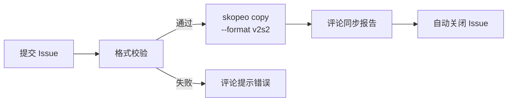

# Registry Mirror

基于 skopeo 实现的容器镜像同步工具。通过 GitHub Issue 提交镜像列表，自动同步到目标仓库，使用 `--format v2s2` 确保 Docker V2 Schema 2 兼容性。

## 工作流程



## 快速开始

### 1. Fork 本仓库

### 2. 创建 Labels

在仓库 **Issues → Labels** 中创建以下标签：

| Label | 颜色建议 | 说明 |
|-------|---------|------|
| `mirror-request` | `#0075ca` | 镜像同步请求，由 Issue 模板自动添加，工作流依赖此标签触发 |
| `completed` | `#0e8a16` | 同步完成，由工作流在全部镜像同步成功后自动添加 |

> **注意**：`mirror-request` 标签必须手动创建，否则 Issue 模板无法自动打标签，工作流将不会触发。

### 3. 配置仓库变量和密钥

在仓库 **Settings → Secrets and variables → Actions** 中配置：

| 名称 | 类型 | 说明 | 示例 |
|------|------|------|------|
| `TARGET_REGISTRY` | Variable | 目标仓库地址 | `registry.cn-beijing.aliyuncs.com` |
| `TARGET_NAMESPACE` | Variable | 目标命名空间 | `my-mirrors` |
| `TARGET_REGISTRY_USER` | Variable | 仓库用户名 | `user@china` |
| `TARGET_REGISTRY_PASSWORD` | Secret | 仓库密码 | - |

### 4. 提交镜像同步请求

通过 Issue 模板提交，每行一个镜像，**必须带 tag**：

```
nginx:latest
gcr.io/google-containers/pause:3.9
registry.k8s.io/kube-apiserver:v1.28.0
quay.io/prometheus/node-exporter:v1.7.0
```

可选勾选 **Sync all architectures** 同步所有架构。

### 5. 等待同步完成

工作流会自动：
- 校验镜像格式
- 并行同步镜像（默认 5 个并发）
- 评论同步报告（含耗时）
- 全部成功后自动关闭 Issue

## 镜像命名规则

源镜像会扁平化映射到目标仓库：

| 源镜像 | 目标镜像 |
|--------|----------|
| `nginx:latest` | `TARGET_REGISTRY/TARGET_NAMESPACE/nginx:latest` |
| `gcr.io/google-containers/pause:3.9` | `TARGET_REGISTRY/TARGET_NAMESPACE/pause:3.9` |
| `registry.k8s.io/kube-apiserver:v1.28.0` | `TARGET_REGISTRY/TARGET_NAMESPACE/kube-apiserver:v1.28.0` |

## 支持的源仓库

- Docker Hub (`docker.io`)
- Google Container Registry (`gcr.io`)
- Kubernetes Registry (`registry.k8s.io`)
- Quay (`quay.io`)
- GitHub Container Registry (`ghcr.io`)
- 其他公开可访问的容器镜像仓库

## 特性

- **skopeo + v2s2**：使用 skopeo copy，强制 Docker V2 Schema 2 manifest 格式
- **并行同步**：默认 5 个并发，可通过 `MAX_PARALLEL` 环境变量调整
- **逐镜像隔离**：单个镜像失败不影响其他镜像同步
- **自动重试**：skopeo 原生重试机制，默认 3 次
- **多架构支持**：可选同步所有架构（`--all`）
- **自动报告**：Issue 评论中展示详细同步结果和耗时
- **并发控制**：同一 Issue 同时只运行一个工作流

## 常见问题

**Q: 同步失败怎么办？**
重新打开 Issue 即可触发重试。检查镜像名称和 tag 是否正确，源镜像是否可公开访问。

**Q: 如何同步多架构镜像？**
在提交 Issue 时勾选 "Sync all architectures" 选项。

**Q: 为什么使用 `--format v2s2`？**
确保目标仓库中的镜像使用 Docker V2 Schema 2 manifest 格式，兼容不支持 OCI manifest 的旧版 Docker 和仓库。

## License

[Apache License 2.0](LICENSE)
